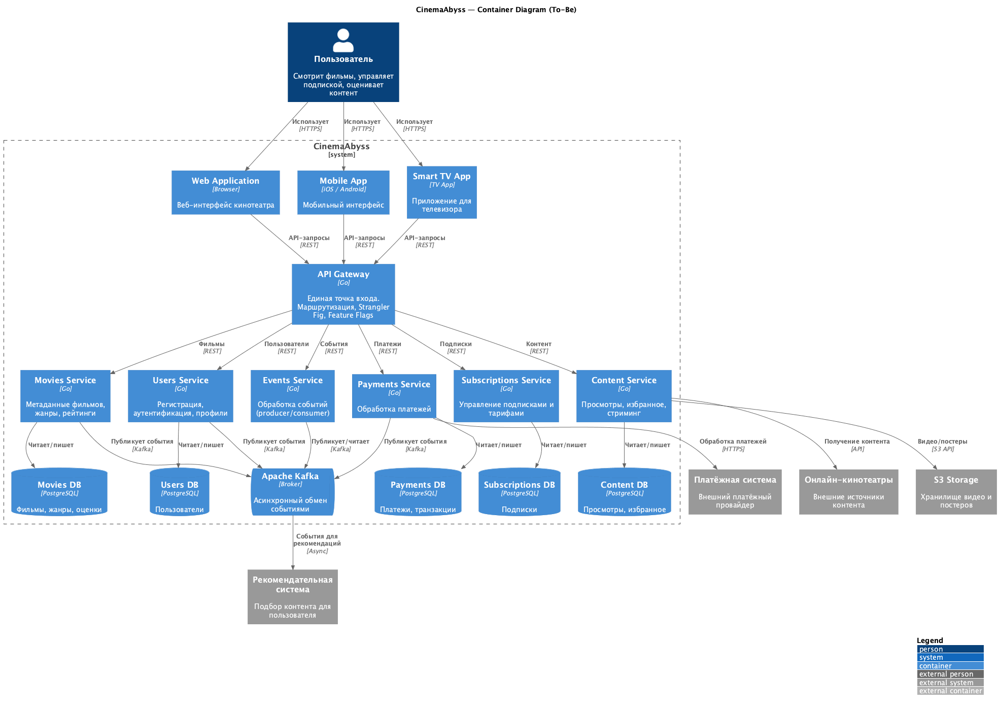
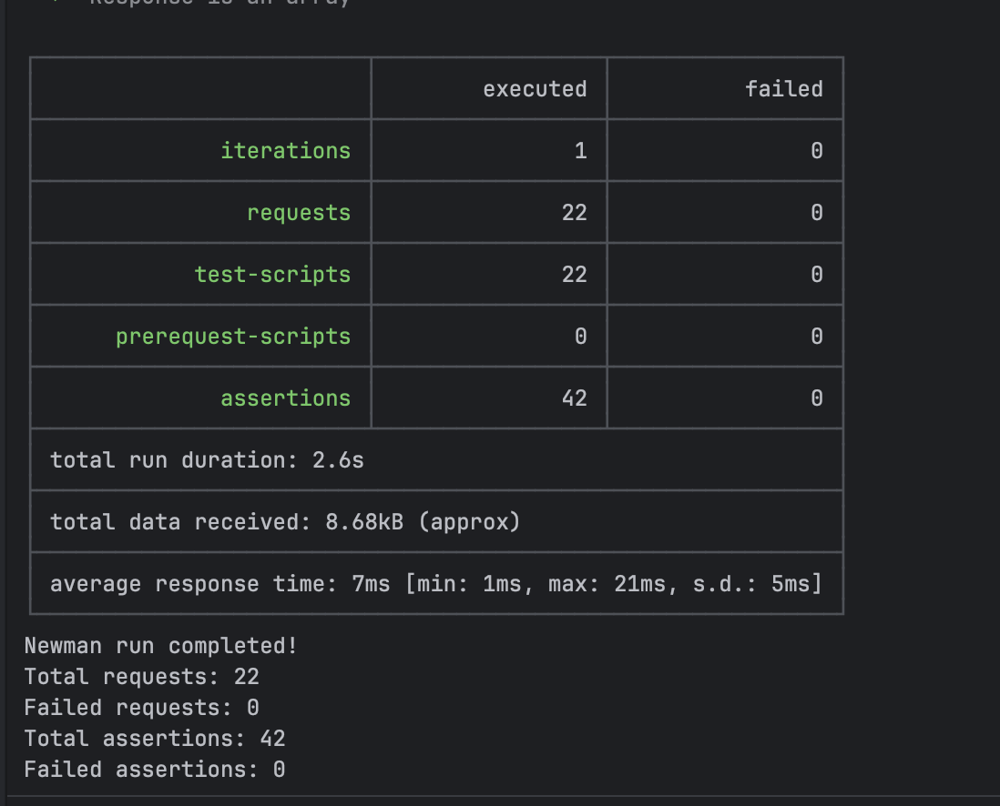
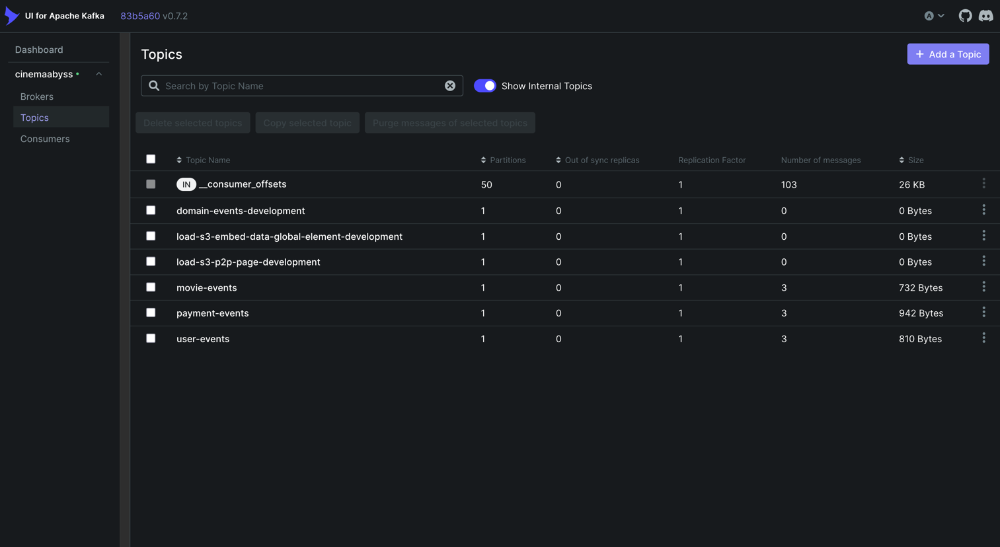

## Изучите [README.md](.\README.md) файл и структуру проекта.

# Задание 1

1. Спроектируйте to be архитектуру КиноБездны, разделив всю систему на отдельные домены и организовав интеграционное взаимодействие и единую точку вызова сервисов.
Результат представьте в виде контейнерной диаграммы в нотации С4.
Добавьте ссылку на файл в этот шаблон

- [C4 Container Diagram (PlantUML)](./docs/c4-container-to-be.puml)
- [C4 Container Diagram (PNG)](./docs/C4_CinemaAbyss_ToBe.png)



# Задание 2

### 1. Proxy
Команда КиноБездны уже выделила сервис метаданных о фильмах movies и вам необходимо реализовать бесшовный переход с применением паттерна Strangler Fig в части реализации прокси-сервиса (API Gateway), с помощью которого можно будет постепенно переключать траффик, используя фиче-флаг.


Реализуйте сервис на любом языке программирования в ./src/microservices/proxy.
Конфигурация для запуска сервиса через docker-compose уже добавлена
```yaml
  proxy-service:
    build:
      context: ./src/microservices/proxy
      dockerfile: Dockerfile
    container_name: cinemaabyss-proxy-service
    depends_on:
      - monolith
      - movies-service
      - events-service
    ports:
      - "8000:8000"
    environment:
      PORT: 8000
      MONOLITH_URL: http://monolith:8080
      #монолит
      MOVIES_SERVICE_URL: http://movies-service:8081 #сервис movies
      EVENTS_SERVICE_URL: http://events-service:8082 
      GRADUAL_MIGRATION: "true" # вкл/выкл простого фиче-флага
      MOVIES_MIGRATION_PERCENT: "50" # процент миграции
    networks:
      - cinemaabyss-network
```

- После реализации запустите postman тесты - они все должны быть зеленые (кроме events).
- Отправьте запросы к API Gateway:
   ```bash
   curl http://localhost:8000/api/movies
   ```
- Протестируйте постепенный переход, изменив переменную окружения MOVIES_MIGRATION_PERCENT в файле docker-compose.yml.

#### Решение

Сервис реализован на **TypeScript + Express + http-proxy-middleware**. Код разбит на модули:

```
src/microservices/proxy/src/
├── index.ts    — точка входа, bootstrap
├── config.ts   — загрузка env-переменных
├── routes.ts   — маршрутизация + Strangler Fig
└── types.ts    — интерфейсы
```

**Маршрутизация:**

| Путь | Куда уходит |
|---|---|
| `GET /health` | отвечает сам прокси |
| `/api/movies*` | **Strangler Fig** — с вероятностью `MOVIES_MIGRATION_PERCENT%` в `movies-service`, иначе в монолит |
| `/api/events/*` | `events-service` |
| `/api/users`, `/api/payments`, `/api/subscriptions` | монолит |

При `MOVIES_MIGRATION_PERCENT=100` трафик полностью уходит в новый сервис, при `0` — в монолит, любое промежуточное значение даёт постепенный переход.

**Проверка через API Gateway** — `curl http://localhost:8000/api/movies`:

```json
[
  {
    "id": 1,
    "title": "The Shawshank Redemption",
    "description": "Two imprisoned men bond over a number of years, finding solace and eventual redemption through acts of common decency.",
    "genres": ["Drama"],
    "rating": 9.3
  },
  {
    "id": 2,
    "title": "The Godfather",
    "description": "The aging patriarch of an organized crime dynasty transfers control of his clandestine empire to his reluctant son.",
    "genres": ["Crime", "Drama"],
    "rating": 9.2
  },
  {
    "id": 3,
    "title": "The Dark Knight",
    "description": "When the menace known as the Joker wreaks havoc and chaos on the people of Gotham, Batman must accept one of the greatest psychological and physical tests of his ability to fight injustice.",
    "genres": ["Action", "Crime", "Drama"],
    "rating": 9.0
  },
  {
    "id": 4,
    "title": "Pulp Fiction",
    "description": "The lives of two mob hitmen, a boxer, a gangster and his wife, and a pair of diner bandits intertwine in four tales of violence and redemption.",
    "genres": ["Crime", "Drama"],
    "rating": 8.9
  },
  {
    "id": 5,
    "title": "Forrest Gump",
    "description": "The presidencies of Kennedy and Johnson, the Vietnam War, the Watergate scandal and other historical events unfold from the perspective of an Alabama man with an IQ of 75, whose only desire is to be reunited with his childhood sweetheart.",
    "genres": ["Drama", "Romance"],
    "rating": 8.8
  }
]
```


### 2. Kafka
 Вам как архитектуру нужно также проверить гипотезу насколько просто реализовать применение Kafka в данной архитектуре.

Для этого нужно сделать MVP сервис events, который будет при вызове API создавать и сам же читать сообщения в топике Kafka.

    - Разработайте сервис на любом языке программирования с consumer'ами и producer'ами.
    - Реализуйте простой API, при вызове которого будут создаваться события User/Payment/Movie и обрабатываться внутри сервиса с записью в лог
    - Добавьте в docker-compose новый сервис, kafka там уже есть

Необходимые тесты для проверки этого API вызываются при запуске npm run test:local из папки tests/postman 
Приложите скриншот тестов и скриншот состояния топиков Kafka из UI http://localhost:8090 

#### Решение

MVP-сервис реализован на **TypeScript + Express + KafkaJS**. Код разбит на модули:

```
src/microservices/events/src/
├── index.ts    — точка входа, старт producer и consumers
├── config.ts   — загрузка env (PORT, KAFKA_BROKERS)
├── kafka.ts    — producer, publishEvent, запуск consumer'ов
├── routes.ts   — REST-эндпоинты
└── types.ts    — интерфейсы событий, константы топиков
```

**API:**

| Эндпоинт | Топик Kafka |
|---|---|
| `POST /api/events/movie` | `movie-events` |
| `POST /api/events/user` | `user-events` |
| `POST /api/events/payment` | `payment-events` |
| `GET  /api/events/health` | health |

**Producer + Consumer в одном сервисе:** при старте поднимается producer и три независимых consumer'а (каждый со своей группой `events-{type}-group`). При вызове API эндпоинт **публикует** событие в соответствующий топик, а consumer того же сервиса **читает** его и пишет в лог — этим проверяется сквозной цикл producer → Kafka → consumer.

**Формат ответа** (по спецификации):

```json
{
  "status": "success",
  "partition": 0,
  "offset": 3,
  "event": {
    "id": "movie-1-viewed",
    "type": "movie",
    "timestamp": "2026-04-13T17:51:54.123Z",
    "payload": { "movie_id": 1, "title": "Inception", "action": "viewed", "user_id": 1 }
  }
}
```

**Пример логов сервиса** (producer → consumer):

```
[Producer][movie-events] partition=0 offset=0 event= {"id":"movie-1-viewed",...}
[Consumer][movie-events] partition=0 offset=0 event= {"id":"movie-1-viewed",...}
```


### Результаты postman-тестов (`npm run test:local`)

22 запроса, 42 ассерта — 0 ошибок.



### Состояние топиков Kafka

Все три топика созданы и содержат сообщения: `movie-events`, `user-events`, `payment-events`.



# Задание 3

Команда начала переезд в Kubernetes для лучшего масштабирования и повышения надежности. 
Вам, как архитектору осталось самое сложное:
 - реализовать CI/CD для сборки прокси сервиса
 - реализовать необходимые конфигурационные файлы для переключения трафика.


### CI/CD

 В папке .github/worflows доработайте деплой новых сервисов proxy и events в docker-build-push.yml , чтобы api-tests при сборке отрабатывали корректно при отправке коммита в ваш репозиторий.

Нужно доработать 
```yaml
on:
  push:
    branches: [ main ]
    paths:
      - 'src/**'
      - '.github/workflows/docker-build-push.yml'
  release:
    types: [published]
```
и добавить необходимые шаги в блок
```yaml
jobs:
  build-and-push:
    runs-on: ubuntu-latest
    permissions:
      contents: read
      packages: write

    steps:
      - name: Checkout repository
        uses: actions/checkout@v3

      - name: Set up Docker Buildx
        uses: docker/setup-buildx-action@v2

      - name: Log in to the Container registry
        uses: docker/login-action@v2
        with:
          registry: ${{ env.REGISTRY }}
          username: ${{ github.actor }}
          password: ${{ secrets.GITHUB_TOKEN }}

```
Как только сборка отработает и в github registry появятся ваши образы, можно переходить к блоку настройки Kubernetes
Успешным результатом данного шага является "зеленая" сборка и "зеленые" тесты


### Proxy в Kubernetes

#### Шаг 1
Для деплоя в kubernetes необходимо залогиниться в docker registry Github'а.
1. Создайте Personal Access Token (PAT) https://github.com/settings/tokens . Создавайте class с правом read:packages
2. В src/kubernetes/*.yaml (event-service, monolith, movies-service и proxy-service)  отредактируйте путь до ваших образов 
```bash
 spec:
      containers:
      - name: events-service
        image: ghcr.io/ваш логин/имя репозитория/events-service:latest
```
3. Добавьте в секрет src/kubernetes/dockerconfigsecret.yaml в поле
```bash
 .dockerconfigjson: значение в base64 файла ~/.docker/config.json
```

4. Если в ~/.docker/config.json нет значения для аутентификации
```json
{
        "auths": {
                "ghcr.io": {
                       тут пусто
                }
        }
}
```
то выполните 

и добавьте

```json 
 "auth": "имя пользователя:токен в base64"
```

Чтобы получить значение в base64 можно выполнить команду
```bash
 echo -n ваш_логин:ваш_токен | base64
```

После заполнения config.json, также прогоните содержимое через base64

```bash
cat .docker/config.json | base64
```

и полученное значение добавляем в

```bash
 .dockerconfigjson: значение в base64 файла ~/.docker/config.json
```

#### Шаг 2

  Доработайте src/kubernetes/event-service.yaml и src/kubernetes/proxy-service.yaml

  - Необходимо создать Deployment и Service 
  - Доработайте ingress.yaml, чтобы можно было с помощью тестов проверить создание событий
  - Выполните дальшейшие шаги для поднятия кластера:

  1. Создайте namespace:
  ```bash
  kubectl apply -f src/kubernetes/namespace.yaml
  ```
  2. Создайте секреты и переменные
  ```bash
  kubectl apply -f src/kubernetes/configmap.yaml
  kubectl apply -f src/kubernetes/secret.yaml
  kubectl apply -f src/kubernetes/dockerconfigsecret.yaml
  kubectl apply -f src/kubernetes/postgres-init-configmap.yaml
  ```

  3. Разверните базу данных:
  ```bash
  kubectl apply -f src/kubernetes/postgres.yaml
  ```

  На этом этапе если вызвать команду
  ```bash
  kubectl -n cinemaabyss get pod
  ```
  Вы увидите

  NAME         READY   STATUS    
  postgres-0   1/1     Running   

  4. Разверните Kafka:
  ```bash
  kubectl apply -f src/kubernetes/kafka/kafka.yaml
  ```

  Проверьте, теперь должно быть запущено 3 пода, если что-то не так, то посмотрите логи
  ```bash
  kubectl -n cinemaabyss logs имя_пода (например - kafka-0)
  ```

  5. Разверните монолит:
  ```bash
  kubectl apply -f src/kubernetes/monolith.yaml
  ```
  6. Разверните микросервисы:
  ```bash
  kubectl apply -f src/kubernetes/movies-service.yaml
  kubectl apply -f src/kubernetes/events-service.yaml
  ```
  7. Разверните прокси-сервис:
  ```bash
  kubectl apply -f src/kubernetes/proxy-service.yaml
  ```

  После запуска и поднятия подов вывод команды 
  ```bash
  kubectl -n cinemaabyss get pod
  ```

  Будет наподобие такого

```bash
  NAME                              READY   STATUS    

  events-service-7587c6dfd5-6whzx   1/1     Running  

  kafka-0                           1/1     Running   

  monolith-8476598495-wmtmw         1/1     Running  

  movies-service-6d5697c584-4qfqs   1/1     Running  

  postgres-0                        1/1     Running  

  proxy-service-577d6c549b-6qfcv    1/1     Running  

  zookeeper-0                       1/1     Running 
```

  8. Добавим ingress

  - добавьте аддон
  ```bash
  minikube addons enable ingress
  ```
  ```bash
  kubectl apply -f src/kubernetes/ingress.yaml
  ```
  9. Добавьте в /etc/hosts
  127.0.0.1 cinemaabyss.example.com

  10. Вызовите
  ```bash
  minikube tunnel
  ```
  11. Вызовите https://cinemaabyss.example.com/api/movies
  Вы должны увидеть вывод списка фильмов
  Можно поэкспериментировать со значением   MOVIES_MIGRATION_PERCENT в src/kubernetes/configmap.yaml и убедится, что вызовы movies уходят полностью в новый сервис

  12. Запустите тесты из папки tests/postman
  ```bash
   npm run test:kubernetes
  ```
  Часть тестов с health-чек упадет, но создание событий отработает.
  Откройте логи event-service и сделайте скриншот обработки событий

#### Шаг 3
Добавьте сюда скриншота вывода при вызове https://cinemaabyss.example.com/api/movies и  скриншот вывода event-service после вызова тестов.


# Задание 4
Для простоты дальнейшего обновления и развертывания вам как архитектуру необходимо так же реализовать helm-чарты для прокси-сервиса и проверить работу 

Для этого:
1. Перейдите в директорию helm и отредактируйте файл values.yaml

```yaml
# Proxy service configuration
proxyService:
  enabled: true
  image:
    repository: ghcr.io/db-exp/cinemaabysstest/proxy-service
    tag: latest
    pullPolicy: Always
  replicas: 1
  resources:
    limits:
      cpu: 300m
      memory: 256Mi
    requests:
      cpu: 100m
      memory: 128Mi
  service:
    port: 80
    targetPort: 8000
    type: ClusterIP
```

- Вместо ghcr.io/db-exp/cinemaabysstest/proxy-service напишите свой путь до образа для всех сервисов
- для imagePullSecret проставьте свое значение (скопируйте из конфигурации kubernetes)
  ```yaml
  imagePullSecrets:
      dockerconfigjson: ewoJImF1dGhzIjogewoJCSJnaGNyLmlvIjogewoJCQkiYXV0aCI6ICJaR0l0Wlhod09tZG9jRjl2UTJocVZIa3dhMWhKVDIxWmFVZHJOV2hRUW10aFVXbFZSbTVaTjJRMFNYUjRZMWM9IgoJCX0KCX0sCgkiY3JlZHNTdG9yZSI6ICJkZXNrdG9wIiwKCSJjdXJyZW50Q29udGV4dCI6ICJkZXNrdG9wLWxpbnV4IiwKCSJwbHVnaW5zIjogewoJCSIteC1jbGktaGludHMiOiB7CgkJCSJlbmFibGVkIjogInRydWUiCgkJfQoJfSwKCSJmZWF0dXJlcyI6IHsKCQkiaG9va3MiOiAidHJ1ZSIKCX0KfQ==
  ```

2. В папке ./templates/services заполните шаблоны для proxy-service.yaml и events-service.yaml (опирайтесь на свою kubernetes конфигурацию - смысл helm'а сделать шаблоны для быстрого обновления и установки)

```yaml
template:
    metadata:
      labels:
        app: proxy-service
    spec:
      containers:
       Тут ваша конфигурация
```

3. Проверьте установку
Сначала удалим установку руками

```bash
kubectl delete all --all -n cinemaabyss
kubectl delete  namespace cinemaabyss
```
Запустите 
```bash
helm install cinemaabyss .\src\kubernetes\helm --namespace cinemaabyss --create-namespace
```
Если в процессе будет ошибка
```code
[2025-04-08 21:43:38,780] ERROR Fatal error during KafkaServer startup. Prepare to shutdown (kafka.server.KafkaServer)
kafka.common.InconsistentClusterIdException: The Cluster ID OkOjGPrdRimp8nkFohYkCw doesn't match stored clusterId Some(sbkcoiSiQV2h_mQpwy05zQ) in meta.properties. The broker is trying to join the wrong cluster. Configured zookeeper.connect may be wrong.
```

Проверьте развертывание:
```bash
kubectl get pods -n cinemaabyss
minikube tunnel
```

Потом вызовите 
https://cinemaabyss.example.com/api/movies
и приложите скриншот развертывания helm и вывода https://cinemaabyss.example.com/api/movies

## Удаляем все

```bash
kubectl delete all --all -n cinemaabyss
kubectl delete namespace cinemaabyss
```
