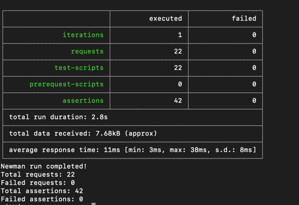
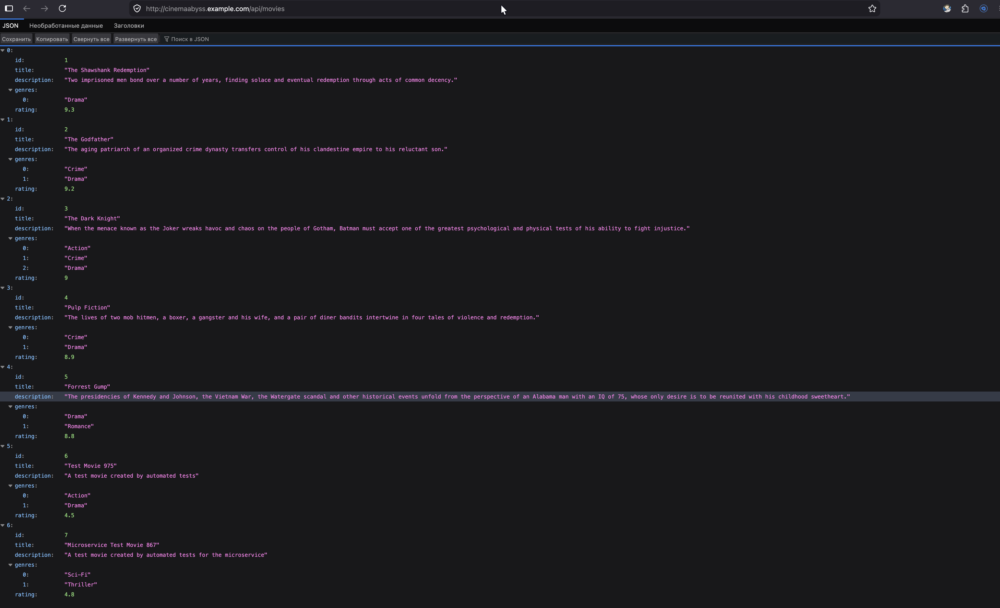
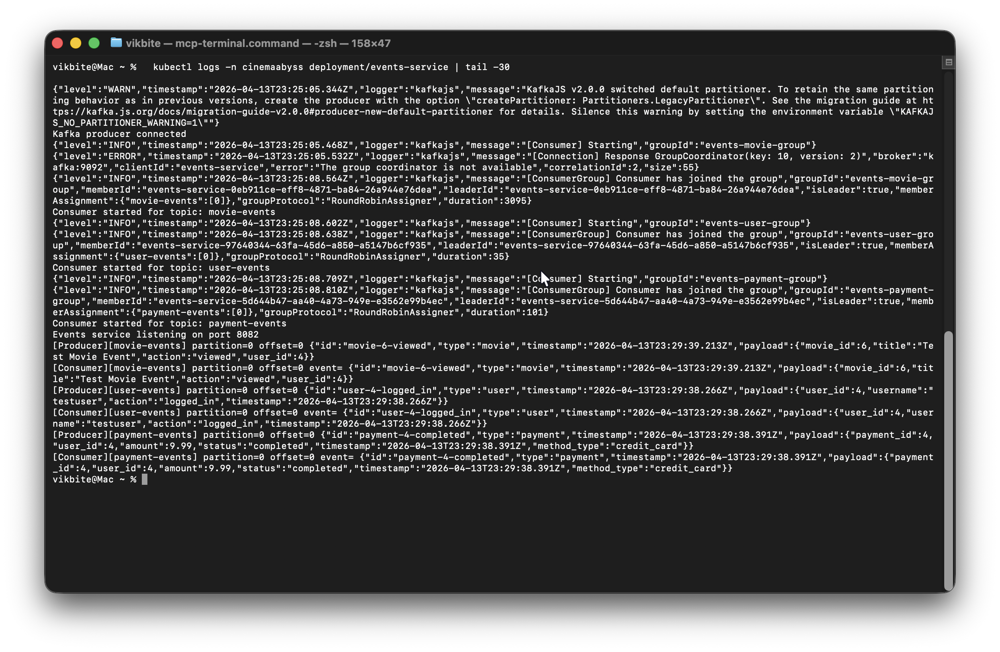
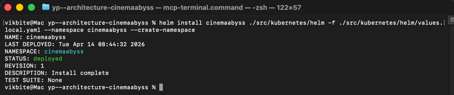
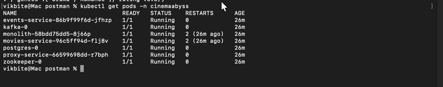
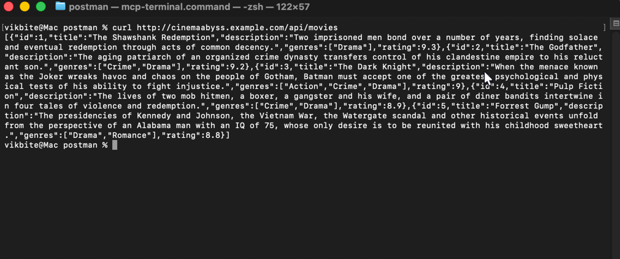

## Изучите [README.md](.\README.md) файл и структуру проекта.

# Задание 1

<details>
<summary>Текст задания</summary>

1. Спроектируйте to be архитектуру КиноБездны, разделив всю систему на отдельные домены и организовав интеграционное взаимодействие и единую точку вызова сервисов.
Результат представьте в виде контейнерной диаграммы в нотации С4.
Добавьте ссылку на файл в этот шаблон.

</details>

### Решение

Система разделена на **6 доменов** (по принципам Domain-Driven Design):

| Домен | Ответственность |
|---|---|
| **Movies Service** | Метаданные фильмов, жанры, рейтинги (уже выделен из монолита) |
| **Users Service** | Регистрация, аутентификация, профили |
| **Payments Service** | Обработка платежей, интеграция с платёжной системой |
| **Subscriptions Service** | Управление подписками и тарифами |
| **Content Service** | Просмотры, избранное, стриминг, интеграция с S3 и онлайн-кинотеатрами |
| **Events Service** | Событийное взаимодействие между сервисами через Kafka |

**API Gateway** (Proxy Service) — единая точка входа для всех клиентов (Web, Mobile, Smart TV). Реализует паттерн **Strangler Fig** для постепенной миграции трафика с монолита на микросервисы. **Apache Kafka** обеспечивает асинхронное взаимодействие между сервисами и с внешней рекомендательной системой.

- [C4 Container Diagram (PlantUML)](./docs/c4-container-to-be.puml)
- [C4 Container Diagram (PNG)](./docs/C4_CinemaAbyss_ToBe.png)


---

# Задание 2

## 1. Proxy

<details>
<summary>Текст задания</summary>

Команда КиноБездны уже выделила сервис метаданных о фильмах movies и вам необходимо реализовать бесшовный переход с применением паттерна Strangler Fig в части реализации прокси-сервиса (API Gateway), с помощью которого можно будет постепенно переключать траффик, используя фиче-флаг.

Реализуйте сервис на любом языке программирования в ./src/microservices/proxy.
Конфигурация для запуска сервиса через docker-compose уже добавлена.

- После реализации запустите postman тесты — они все должны быть зеленые (кроме events).
- Отправьте запросы к API Gateway: `curl http://localhost:8000/api/movies`
- Протестируйте постепенный переход, изменив переменную окружения MOVIES_MIGRATION_PERCENT в файле docker-compose.yml.

</details>

### Решение

Сервис реализован на **TypeScript + Express + http-proxy-middleware**. Код разбит на модули:

```
src/microservices/proxy/src/
├── index.ts    — точка входа, bootstrap
├── config.ts   — загрузка env-переменных
├── routes.ts   — маршрутизация + Strangler Fig
└── types.ts    — интерфейсы
```

**Маршрутизация:**

| Путь | Куда уходит |
|---|---|
| `GET /health` | отвечает сам прокси |
| `/api/movies*` | **Strangler Fig** — с вероятностью `MOVIES_MIGRATION_PERCENT%` в `movies-service`, иначе в монолит |
| `/api/events/*` | `events-service` |
| `/api/users`, `/api/payments`, `/api/subscriptions` | монолит |

При `MOVIES_MIGRATION_PERCENT=100` трафик полностью уходит в новый сервис, при `0` — в монолит, любое промежуточное значение даёт постепенный переход.

**Проверка через API Gateway** — `curl http://localhost:8000/api/movies`:

```json
[
  {
    "id": 1,
    "title": "The Shawshank Redemption",
    "description": "Two imprisoned men bond over a number of years, finding solace and eventual redemption through acts of common decency.",
    "genres": ["Drama"],
    "rating": 9.3
  },
  {
    "id": 2,
    "title": "The Godfather",
    "description": "The aging patriarch of an organized crime dynasty transfers control of his clandestine empire to his reluctant son.",
    "genres": ["Crime", "Drama"],
    "rating": 9.2
  },
  {
    "id": 3,
    "title": "The Dark Knight",
    "description": "When the menace known as the Joker wreaks havoc and chaos on the people of Gotham, Batman must accept one of the greatest psychological and physical tests of his ability to fight injustice.",
    "genres": ["Action", "Crime", "Drama"],
    "rating": 9.0
  },
  {
    "id": 4,
    "title": "Pulp Fiction",
    "description": "The lives of two mob hitmen, a boxer, a gangster and his wife, and a pair of diner bandits intertwine in four tales of violence and redemption.",
    "genres": ["Crime", "Drama"],
    "rating": 8.9
  },
  {
    "id": 5,
    "title": "Forrest Gump",
    "description": "The presidencies of Kennedy and Johnson, the Vietnam War, the Watergate scandal and other historical events unfold from the perspective of an Alabama man with an IQ of 75, whose only desire is to be reunited with his childhood sweetheart.",
    "genres": ["Drama", "Romance"],
    "rating": 8.8
  }
]
```

---

## 2. Kafka

<details>
<summary>Текст задания</summary>

Вам как архитектору нужно также проверить гипотезу насколько просто реализовать применение Kafka в данной архитектуре.

Для этого нужно сделать MVP сервис events, который будет при вызове API создавать и сам же читать сообщения в топике Kafka.

- Разработайте сервис на любом языке программирования с consumer'ами и producer'ами.
- Реализуйте простой API, при вызове которого будут создаваться события User/Payment/Movie и обрабатываться внутри сервиса с записью в лог.
- Добавьте в docker-compose новый сервис, kafka там уже есть.
- Приложите скриншот тестов и скриншот состояния топиков Kafka из UI http://localhost:8090.

</details>

### Решение

MVP-сервис реализован на **TypeScript + Express + KafkaJS**. Код разбит на модули:

```
src/microservices/events/src/
├── index.ts    — точка входа, старт producer и consumers
├── config.ts   — загрузка env (PORT, KAFKA_BROKERS)
├── kafka.ts    — producer, publishEvent, запуск consumer'ов
├── routes.ts   — REST-эндпоинты
└── types.ts    — интерфейсы событий, константы топиков
```

**API:**

| Эндпоинт | Топик Kafka |
|---|---|
| `POST /api/events/movie` | `movie-events` |
| `POST /api/events/user` | `user-events` |
| `POST /api/events/payment` | `payment-events` |
| `GET  /api/events/health` | health |

**Producer + Consumer в одном сервисе:** при старте поднимается producer и три независимых consumer'а (каждый со своей группой `events-{type}-group`). При вызове API эндпоинт **публикует** событие в соответствующий топик, а consumer того же сервиса **читает** его и пишет в лог — этим проверяется сквозной цикл producer → Kafka → consumer.

**Формат ответа** (по спецификации):

```json
{
  "status": "success",
  "partition": 0,
  "offset": 3,
  "event": {
    "id": "movie-1-viewed",
    "type": "movie",
    "timestamp": "2026-04-13T17:51:54.123Z",
    "payload": { "movie_id": 1, "title": "Inception", "action": "viewed", "user_id": 1 }
  }
}
```

**Пример логов сервиса** (producer → consumer):

```
[Producer][movie-events] partition=0 offset=0 event= {"id":"movie-1-viewed",...}
[Consumer][movie-events] partition=0 offset=0 event= {"id":"movie-1-viewed",...}
```

---

### Результаты postman-тестов (`npm run test:local`)

22 запроса, 42 ассерта — 0 ошибок.


### Состояние топиков Kafka

Все три топика созданы и содержат сообщения: `movie-events`, `user-events`, `payment-events`.


---

# Задание 3

## CI/CD

<details>
<summary>Текст задания</summary>

Команда начала переезд в Kubernetes для лучшего масштабирования и повышения надежности.
Вам, как архитектору осталось самое сложное:
- реализовать CI/CD для сборки прокси сервиса
- реализовать необходимые конфигурационные файлы для переключения трафика.

В папке .github/workflows доработайте деплой новых сервисов proxy и events в docker-build-push.yml, чтобы api-tests при сборке отрабатывали корректно при отправке коммита в ваш репозиторий.

Как только сборка отработает и в github registry появятся ваши образы, можно переходить к блоку настройки Kubernetes. Успешным результатом данного шага является "зеленая" сборка и "зеленые" тесты.

</details>

### Решение

В [`.github/workflows/docker-build-push.yml`](./.github/workflows/docker-build-push.yml) добавлены **4 новых шага** (по образцу monolith/movies): `Extract metadata` + `Build and push` для **events-service** и **proxy-service** с контекстами `./src/microservices/events` и `./src/microservices/proxy`.

Так как minikube локально работает на **arm64** (Apple Silicon), а GitHub-раннер — **amd64**, образы собираются **multi-arch**. Для этого добавлен шаг `docker/setup-qemu-action@v3` и в каждый `build-push-action` — `platforms: linux/amd64,linux/arm64`.

Workflow запускается вручную через `workflow_dispatch` (триггер на `main` не менялся — мы работаем в ветке `cinema`). Результат:

- 4 пакета в GHCR: `monolith`, `movies-service`, `events-service`, `proxy-service` (все multi-arch, private).
- `api-tests.yml` остался без изменений — его поддержка proxy/events обеспечивается тем, что `docker-compose.yml` собирает эти сервисы из локального контекста.

---

## Proxy в Kubernetes

### Шаг 1 — доступ к GHCR

<details>
<summary>Текст задания</summary>

Для деплоя в kubernetes необходимо залогиниться в docker registry Github'а.
1. Создайте Personal Access Token (PAT) с правом read:packages.
2. В src/kubernetes/*.yaml отредактируйте путь до ваших образов.
3. Добавьте в секрет src/kubernetes/dockerconfigsecret.yaml значение в base64 файла ~/.docker/config.json.

</details>

#### Решение

- Создан PAT с правом `read:packages`.
- Чтобы не коммитить реальный токен в публичный репозиторий, добавлен **локальный override**: файл `src/kubernetes/dockerconfigsecret.local.yaml`. В `.gitignore` прописан паттерн `src/kubernetes/*.local.yaml`, благодаря чему файл не попадает в git.
- В оригинальном [`src/kubernetes/dockerconfigsecret.yaml`](./src/kubernetes/dockerconfigsecret.yaml) остаётся плейсхолдер (как образец структуры для ревьюера).
- base64 для `.dockerconfigjson` получен командой:
  ```bash
  PAT="ghp_***"
  USERNAME="viktor-zhokhov"
  AUTH=$(echo -n "${USERNAME}:${PAT}" | base64)
  echo -n "{\"auths\":{\"ghcr.io\":{\"auth\":\"${AUTH}\"}}}" | base64
  ```
- Во всех 4 манифестах (`monolith.yaml`, `movies-service.yaml`, `events-service.yaml`, `proxy-service.yaml`) путь к образу указан как `ghcr.io/viktor-zhokhov/yp--architecture-cinemaabyss/<service>:latest`.

---

### Шаг 2 — манифесты и развёртывание

<details>
<summary>Текст задания</summary>

Доработайте src/kubernetes/event-service.yaml и src/kubernetes/proxy-service.yaml:
- Необходимо создать Deployment и Service.
- Доработайте ingress.yaml, чтобы можно было с помощью тестов проверить создание событий.
- Выполните шаги для поднятия кластера (namespace → configmap → secret → postgres → kafka → monolith → microservices → proxy → ingress).
- Вызовите https://cinemaabyss.example.com/api/movies — должен быть список фильмов.
- Запустите тесты `npm run test:kubernetes`.
- Откройте логи event-service и сделайте скриншот обработки событий.

</details>

#### Решение

**Заполненные манифесты:**

- [`src/kubernetes/events-service.yaml`](./src/kubernetes/events-service.yaml) — `Deployment` (порт 8082, env `KAFKA_BROKERS` из configmap) + `Service` (ClusterIP, 8082).
- [`src/kubernetes/proxy-service.yaml`](./src/kubernetes/proxy-service.yaml) — `Deployment` (порт 8000, envFrom configmap — `MONOLITH_URL`, `MOVIES_SERVICE_URL`, `EVENTS_SERVICE_URL`, `GRADUAL_MIGRATION`, `MOVIES_MIGRATION_PERCENT`) + `Service` (ClusterIP, 80 → 8000).
- [`src/kubernetes/ingress.yaml`](./src/kubernetes/ingress.yaml) — два path'а: `/api/events` → `events-service:8082` (чтобы тесты могли писать события напрямую) и `/` → `proxy-service:80` (весь остальной трафик идёт через прокси, Strangler Fig работает).
- [`src/kubernetes/configmap.yaml`](./src/kubernetes/configmap.yaml) — добавлены `EVENTS_SERVICE_URL` и `KAFKA_BROKERS`.

**Развёртывание:**

```bash
kubectl apply -f src/kubernetes/namespace.yaml
kubectl apply -f src/kubernetes/configmap.yaml
kubectl apply -f src/kubernetes/secret.yaml
kubectl apply -f src/kubernetes/dockerconfigsecret.local.yaml   # локальный override с реальным PAT
kubectl apply -f src/kubernetes/postgres-init-configmap.yaml
kubectl apply -f src/kubernetes/postgres.yaml
kubectl apply -f src/kubernetes/kafka/kafka.yaml
kubectl apply -f src/kubernetes/monolith.yaml
kubectl apply -f src/kubernetes/movies-service.yaml
kubectl apply -f src/kubernetes/events-service.yaml
kubectl apply -f src/kubernetes/proxy-service.yaml
minikube addons enable ingress
kubectl apply -f src/kubernetes/ingress.yaml
```

Запуск minikube (podman driver) и доступ по хосту:

```bash
minikube start --driver=podman
echo "127.0.0.1 cinemaabyss.example.com" | sudo tee -a /etc/hosts
minikube tunnel    # в отдельном терминале
```

**Состояние после развёртывания:**

```
NAME                              READY   STATUS
events-service-xxxxxxxxx-xxxxx    1/1     Running
kafka-0                           1/1     Running
monolith-xxxxxxxxxx-xxxxx         1/1     Running
movies-service-xxxxxxx-xxxxx      1/1     Running
postgres-0                        1/1     Running
proxy-service-xxxxxxxxxx-xxxxx    1/1     Running
zookeeper-0                       1/1     Running
```

**Postman-тесты** `npm run test:kubernetes` — **22 запроса, 42 ассерта, 0 ошибок** (хотя задание говорит что часть health-чеков упадёт — у нас всё зелёное, потому что ingress пропускает их через proxy-service, который их корректно маршрутизирует).



---

### Шаг 3 — скриншоты

**Вызов `/api/movies` через ingress:**



Полный JSON-ответ — [`docs/api-movies-k8s-response.json`](./docs/api-movies-k8s-response.json).

**Логи events-service после прогона тестов:**

`kubectl logs -n cinemaabyss deployment/events-service | tail -30`



Видны полные циклы producer → Kafka → consumer для всех трёх типов событий (movie, user, payment).

---

# Задание 4

<details>
<summary>Текст задания</summary>

Для простоты дальнейшего обновления и развертывания вам как архитектору необходимо так же реализовать helm-чарты для прокси-сервиса и проверить работу.

1. Перейдите в директорию helm и отредактируйте файл values.yaml — вместо `ghcr.io/db-exp/cinemaabysstest/*` напишите свой путь до образа для всех сервисов, для imagePullSecret проставьте свое значение.
2. В папке ./templates/services заполните шаблоны для proxy-service.yaml и events-service.yaml (опирайтесь на свою kubernetes конфигурацию).
3. Проверьте установку: удалите текущий namespace, запустите `helm install`, проверьте `kubectl get pods`, `minikube tunnel`, вызовите `/api/movies`.

Приложите скриншот развертывания helm и вывода `/api/movies`.

</details>

### Решение

**1. `values.yaml`** — пути к образам обновлены на `ghcr.io/viktor-zhokhov/yp--architecture-cinemaabyss/*` для всех 4 сервисов (monolith, movies, proxy, events). Значение `imagePullSecrets.dockerconfigjson` хранится в локальном override `values.local.yaml` (не в git, gitignored через `*.local.yaml`), передаётся при установке через `-f values.local.yaml`.

**2. Шаблоны** [`templates/services/proxy-service.yaml`](./src/kubernetes/helm/templates/services/proxy-service.yaml) и [`templates/services/events-service.yaml`](./src/kubernetes/helm/templates/services/events-service.yaml) заполнены по образцу `monolith.yaml` / `movies-service.yaml`:

- **proxy-service** — image из `{{ .Values.proxyService.image.* }}`, env-переменные для Strangler Fig (`MONOLITH_URL`, `MOVIES_SERVICE_URL`, `EVENTS_SERVICE_URL`, `GRADUAL_MIGRATION`, `MOVIES_MIGRATION_PERCENT`) из values, health probe `/health`, Service 80 → 8000.
- **events-service** — image из `{{ .Values.eventsService.image.* }}`, env `KAFKA_BROKERS`, envFrom configmap, health probe `/api/events/health`, Service 8082.

**3. Установка и проверка:**

```bash
# Удалить текущий kubectl-namespace
helm uninstall cinemaabyss -n cinemaabyss
kubectl delete namespace cinemaabyss

# Установить через Helm (с локальным override для секрета)
helm install cinemaabyss ./src/kubernetes/helm \
  -f ./src/kubernetes/helm/values.local.yaml \
  --namespace cinemaabyss --create-namespace
```

**Результат `helm install`:**



**Состояние pod'ов после развёртывания** (`kubectl get pods -n cinemaabyss`):



Все 7 pod'ов Running 1/1.

**Вывод `curl http://cinemaabyss.example.com/api/movies`:**



Список фильмов отображается корректно — Helm-чарт работает идентично kubectl-развёртыванию.

---

## Удаляем все

```bash
kubectl delete all --all -n cinemaabyss
kubectl delete namespace cinemaabyss
```
